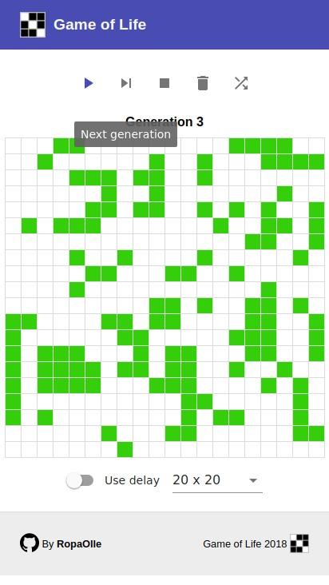

Game of Life
========================================
Implementation of [Conway's Game of Life](https://en.wikipedia.org/wiki/Conway%27s_Game_of_Life) with [Create React App](https://github.com/facebook/create-react-app), [HTML5 Canvas](https://developer.mozilla.org/en-US/docs/Web/API/Canvas_API) and [Material-UI](https://material-ui-next.com/) hosted on [GitHub Pages](https://pages.github.com/).

Demo site at [ropaolle.github.io/game-of-life](https://ropaolle.github.io/game-of-life/).

 

 

<!--

 
-->

# Screens

